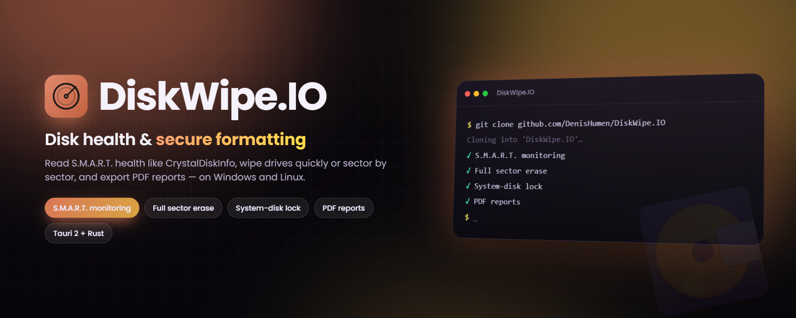

<div align="center">



# DiskWipe.IO

**S.M.A.R.T. disk health monitoring & secure formatting — for Windows and Linux.**

[](https://github.com/DenisHumen/DiskWipe.IO/releases/latest)
[](https://github.com/DenisHumen/DiskWipe.IO/actions/workflows/build.yml)
[](https://tauri.app/)
[](https://www.rust-lang.org/)
[](#-supported-platforms)
[](LICENSE)
[](https://github.com/DenisHumen/DiskWipe.IO/commits/main)

**English** · [Русский](README.ru.md)

[**⬇ Download**](https://github.com/DenisHumen/DiskWipe.IO/releases/latest) &nbsp;·&nbsp; [Features](#-features) &nbsp;·&nbsp; [Quick start](#-quick-start) &nbsp;·&nbsp; [Safety model](#-safety-model) &nbsp;·&nbsp; [Development](#-development)

</div>

---

DiskWipe.IO is a small native desktop app for checking the condition of your drives and wiping them safely. Read drive health the way *CrystalDiskInfo* does, run a quick format or a full sector-by-sector erase, and export a SMART report to PDF — all from one clean window. It is built with Tauri 2 (Rust backend, React + TypeScript UI) and ships `smartctl` inside the installer, so it works out of the box.

## ✨ Features

| | |
|---|---|
| 🩺 **S.M.A.R.T. monitoring** | Full ATA attribute tables and NVMe health logs, with temperature, power-on hours, power cycles and an at-a-glance health verdict (**Good / Caution / Bad**), powered by `smartctl --json`. |
| 🔌 **USB drives too** | Probes USB-SATA and USB-NVMe bridges (SAT, JMicron, Prolific, Sunplus, Cypress, ASMedia…) the way CrystalDiskInfo does, so external disks show full health data, not just pass/fail. |
| 🧹 **Two formatting modes** | **Quick format** recreates the filesystem in seconds; **Full erase** overwrites *every sector* with zeros, then lays down a fresh filesystem — with live progress. exFAT, NTFS, FAT32 and (Linux) ext4, with an optional volume label. |
| 🛡 **System-disk protection** | The drive hosting your OS is detected and **locked**, so it can never be formatted by accident. |
| 🔑 **Serial-confirmation safety** | Destructive actions stay locked until you type the exact device serial number. |
| 📄 **PDF reports** | Export the SMART health of any disk to a clean PDF, choosing exactly where to save it. |
| 📦 **Batteries included** | `smartctl` ships **inside the installer** — nothing else to install. |
| 🔄 **Automatic updates** | On launch the app checks GitHub for a newer **signed** release and, if found, downloads and installs it, then restarts. |
| 🔗 **One-click repository link** | The GitHub icon in the header opens the project page. |
| ⚡ **Native & lightweight** | Built with Tauri 2; ships as a small `.exe` / `.msi` on Windows and `.deb` / `.AppImage` / `.rpm` on Linux. |

## 🚀 Quick start

### Download

Grab the latest installers from the [**Releases**](https://github.com/DenisHumen/DiskWipe.IO/releases/latest) page:

| Platform | File |
| --- | --- |
| **Windows 10/11** | `DiskWipe.IO_x.y.z_x64-setup.exe` or `DiskWipe.IO_x.y.z_x64_en-US.msi` |
| **Ubuntu / Debian** | `DiskWipe.IO_x.y.z_amd64.deb` or the portable `.AppImage` |
| **Fedora / RHEL** | `DiskWipe.IO-x.y.z-1.x86_64.rpm` or the portable `.AppImage` |

`smartctl` is bundled inside every installer, so SMART reads work immediately. The app also **updates itself**: each launch it checks the latest release and installs a newer signed build automatically.

### Privileges

Reading raw drive health and formatting disks need elevated rights. How DiskWipe.IO gets them:

| Platform | Reading SMART | Formatting |
| --- | --- | --- |
| **Windows** | The app asks for administrator rights (UAC) when it starts — like CrystalDiskInfo | Covered by the same elevation |
| **Linux `.deb` / `.rpm`** | Works as a normal user: the installer grants the bundled `smartctl` the capabilities it needs (`setcap`) | Run the app as root (e.g. `sudo`) |
| **Linux `.AppImage`** | Falls back to a graphical PolicyKit (`pkexec`) prompt — authenticate once | Run the app as root (e.g. `sudo`) |

## 🧭 Usage

1. **Pick a disk** in the list on the left. Each entry shows the model, size, bus and HDD/SSD type, and the system disk is marked; the refresh button re-scans.
2. **Check its health** in the SMART panel: overall verdict, temperature, power-on hours and power cycles, plus the full attribute table (ATA) or health log (NVMe).
   - **Bad** — the drive's own SMART self-assessment failed, or an attribute is failing now.
   - **Caution** — a critical counter is non-zero: reallocated sectors (5), reported uncorrectable errors (187), reallocation events (196), pending sectors (197) or offline uncorrectable sectors (198).
   - **Good** — none of the above.
3. **Save PDF** to export the report to a location you choose.
4. **Format** (optional): choose *Quick format* or *Full erase*, a filesystem and a volume label (defaults to `DISKWIPE`), type the disk's serial number to unlock the button, then press **Quick Format** / **Erase & Format**. Progress is shown live.

### 🔒 Safety model

DiskWipe.IO touches raw block devices, so it is deliberately cautious. Before **any** destructive operation it enforces:

1. The target must exist and must **not** be the system disk.
2. No partition may be mounted at a system path (`/`, `/boot`, `/boot/efi`, `/var`, `/usr`).
3. The disk must report a serial number, and you must **type it** to confirm.
4. The process must run with administrator / root privileges.

If any check fails, nothing is written.

### 💻 Supported platforms

| OS | Packages | Formatting |
| --- | --- | --- |
| Windows | `.exe` (NSIS), `.msi` | via `diskpart` — NTFS, FAT32, exFAT (ext4 is not available on Windows and falls back to exFAT) |
| Ubuntu / Debian | `.deb`, `.AppImage` | via `wipefs` + `mkfs.*` — ext4, NTFS, exFAT, FAT32 |
| Fedora / RHEL | `.rpm`, `.AppImage` | via `wipefs` + `mkfs.*` — ext4, NTFS, exFAT, FAT32 |

> macOS is supported as a **development host** for reading disks; formatting is intentionally disabled there.

## 🧱 Architecture

```
React + TypeScript + Tailwind  ──invoke──▶  Rust (Tauri 2) backend
  · DiskList / SmartPanel / FormatPanel       · disks.rs   enumerate + detect system disk
  · jsPDF report generation                   · smart.rs   parse `smartctl --json`, probe USB bridges
  · live format progress via events           · format.rs  guarded quick / full erase
  · in-app updater banner                     · util.rs    privileges & process helpers
```

| Concern | Windows | Linux |
| --- | --- | --- |
| Enumerate | `Get-Disk` (PowerShell) | `lsblk -b -J -O` |
| SMART | `smartctl --json` | `smartctl --json` (via `pkexec` if not privileged) |
| Quick format | `diskpart` (`clean` + `format quick`) | `wipefs` + `mkfs.*` |
| Full erase | `diskpart clean all` | zero-fill + `wipefs` + `mkfs.*` |
| System disk | `IsBoot` / `IsSystem` | root/boot mountpoint |

**Stack:** Tauri 2 · Rust · React 18 · TypeScript · Vite · Tailwind CSS · jsPDF · lucide-react · smartmontools.

## 📁 Project structure

```
DiskWipe.IO/
├── src/                        # React + TypeScript frontend
│   ├── App.tsx                 # layout, disk selection, update check
│   ├── components/             # DiskList, SmartPanel, FormatPanel, UpdateBanner, ui
│   └── lib/                    # Tauri API wrappers, PDF export, SMART labels, updater
├── src-tauri/                  # Rust backend (Tauri 2)
│   ├── src/                    # lib.rs (commands), disks.rs, smart.rs, format.rs, model.rs, util.rs
│   ├── resources/bin/          # smartctl is dropped here by CI and bundled into installers
│   ├── scripts/linux-postinstall.sh   # grants smartctl its capabilities on .deb/.rpm install
│   ├── windows-app-manifest.xml       # requests administrator rights on Windows
│   └── tauri.conf.json         # app, bundle and updater configuration
├── scripts/gen-logo.mjs        # rasterises assets/logo.svg for `tauri icon`
├── assets/logo.svg             # app logo
└── .github/workflows/build.yml # checks, installers and releases
```

## 🛠 Development

### Prerequisites

- [Node.js](https://nodejs.org/) 18+ (CI uses Node 20)
- [Rust](https://rustup.rs/) (stable, 1.77+)
- **smartmontools** — only needed for *local development*. Installed builds ship their own `smartctl`, but `tauri dev` uses one from `PATH`:
  - Ubuntu/Debian: `sudo apt install smartmontools`
  - Fedora: `sudo dnf install smartmontools`
  - macOS: `brew install smartmontools`
  - Windows: [download the installer](https://www.smartmontools.org/) and add it to `PATH`
- Linux only: WebKitGTK & GTK development libraries. On Ubuntu (as in CI):

  ```bash
  sudo apt-get install -y libwebkit2gtk-4.1-dev libgtk-3-dev \
    libayatana-appindicator3-dev librsvg2-dev patchelf
  ```

### Run in development

```bash
npm install
npm run tauri dev      # starts Vite on http://localhost:1420 and the Tauri window
```

### Build installers locally

```bash
npm install
node scripts/gen-logo.mjs && npm run icon   # regenerate app icons from assets/logo.svg (optional)
npm run tauri build
```

Artifacts land in `src-tauri/target/release/bundle/`.

> **Privileges:** SMART and formatting need elevation — see [Privileges](#privileges). A dev build has no bundled `smartctl` capabilities, so on Linux run it with `sudo` or authenticate the `pkexec` prompt.

### Tests

```bash
npm run build                                   # TypeScript check + frontend build
cargo test --manifest-path src-tauri/Cargo.toml # Rust unit tests (SMART parsing, device paths)
```

### 📦 Releases & auto-update (maintainers)

The auto-updater verifies a cryptographic signature, so release bundles must be signed in CI. Two repository **secrets** are required before pushing a release tag:

| Secret | Value |
| --- | --- |
| `TAURI_SIGNING_PRIVATE_KEY` | contents of the generated private key file |
| `TAURI_SIGNING_PRIVATE_KEY_PASSWORD` | the key password (empty if none) |

The matching **public** key is committed in [`src-tauri/tauri.conf.json`](src-tauri/tauri.conf.json) under `plugins.updater.pubkey`. To add the secrets:

```bash
gh secret set TAURI_SIGNING_PRIVATE_KEY < ~/.diskwipe-signing/diskwipe.key
gh secret set TAURI_SIGNING_PRIVATE_KEY_PASSWORD --body ""
```

Cut a release by pushing a tag (keep it in sync with the version in `package.json`, `src-tauri/Cargo.toml` and `src-tauri/tauri.conf.json`):

```bash
git tag -a vX.Y.Z -m "DiskWipe.IO vX.Y.Z" && git push origin vX.Y.Z
```

CI then bundles `smartctl`, builds, signs and publishes the Windows and Linux installers plus the `latest.json` update manifest to the GitHub Release.

## 🤝 Contributing

Issues and pull requests are welcome. CI runs the frontend build and the Rust tests on every push and pull request to `main`; installers are built on release tags (or a manual run of the workflow).

## 🙏 Credits

- [smartmontools](https://www.smartmontools.org/) (`smartctl`) — GPL — bundled to read S.M.A.R.T. data on every platform.
- [CrystalDiskInfo](https://github.com/hiyohiyo/CrystalDiskInfo) — MIT — the inspiration for the health model and SMART presentation. Like CrystalDiskInfo, DiskWipe.IO requests administrator rights on Windows so it can read raw drive health.

## 📄 License

[MIT](LICENSE) © DiskWipe.IO contributors
