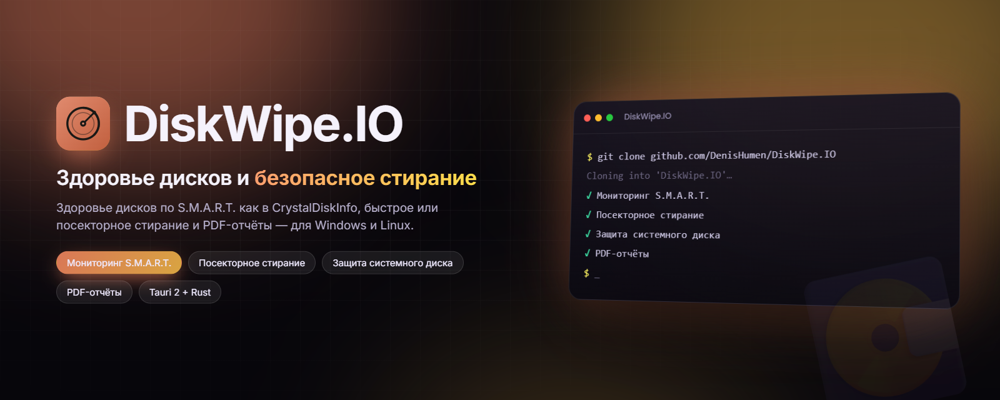

<div align="center">



# DiskWipe.IO

**Мониторинг здоровья дисков по S.M.A.R.T. и безопасное форматирование — для Windows и Linux.**

[](https://github.com/DenisHumen/DiskWipe.IO/releases/latest)
[](https://github.com/DenisHumen/DiskWipe.IO/actions/workflows/build.yml)
[](https://tauri.app/)
[](https://www.rust-lang.org/)
[](#-поддерживаемые-платформы)
[](LICENSE)
[](https://github.com/DenisHumen/DiskWipe.IO/commits/main)

[English](README.md) · **Русский**

[**⬇ Скачать**](https://github.com/DenisHumen/DiskWipe.IO/releases/latest) &nbsp;·&nbsp; [Возможности](#-возможности) &nbsp;·&nbsp; [Быстрый старт](#-быстрый-старт) &nbsp;·&nbsp; [Модель безопасности](#-модель-безопасности) &nbsp;·&nbsp; [Разработка](#-разработка)

</div>

---

DiskWipe.IO — небольшое нативное десктопное приложение, чтобы проверить состояние дисков и безопасно их очистить. Оно показывает здоровье накопителя так же, как *CrystalDiskInfo*, выполняет быстрое форматирование или полное посекторное стирание и сохраняет отчёт S.M.A.R.T. в PDF — всё в одном аккуратном окне. Приложение написано на Tauri 2 (бэкенд на Rust, интерфейс на React + TypeScript) и содержит `smartctl` прямо в установщике, поэтому работает сразу после установки.

## ✨ Возможности

| | |
|---|---|
| 🩺 **Мониторинг S.M.A.R.T.** | Полные таблицы атрибутов ATA и журналы здоровья NVMe: температура, часы работы, число включений и итоговая оценка (**Хорошо / Внимание / Плохо**) — на базе `smartctl --json`. |
| 🔌 **И USB-диски тоже** | Перебирает режимы для мостов USB-SATA и USB-NVMe (SAT, JMicron, Prolific, Sunplus, Cypress, ASMedia…), как это делает CrystalDiskInfo, поэтому внешние диски показывают полные данные, а не только «исправен / неисправен». |
| 🧹 **Два режима форматирования** | **Быстрое форматирование** пересоздаёт файловую систему за секунды; **полное стирание** перезаписывает нулями *каждый сектор*, а затем создаёт новую файловую систему — с прогрессом в реальном времени. exFAT, NTFS, FAT32 и (в Linux) ext4, с необязательной меткой тома. |
| 🛡 **Защита системного диска** | Диск, на котором стоит ОС, определяется и **блокируется** — случайно отформатировать его невозможно. |
| 🔑 **Подтверждение серийным номером** | Разрушительные действия разблокируются, только когда вы вводите точный серийный номер устройства. |
| 📄 **PDF-отчёты** | Экспорт здоровья любого диска по S.M.A.R.T. в аккуратный PDF — в выбранное вами место. |
| 📦 **Всё включено** | `smartctl` поставляется **внутри установщика** — ничего дополнительно ставить не нужно. |
| 🔄 **Автообновление** | При запуске приложение проверяет на GitHub новый **подписанный** релиз и, если он есть, скачивает, устанавливает его и перезапускается. |
| 🔗 **Ссылка на репозиторий** | Иконка GitHub в шапке открывает страницу проекта. |
| ⚡ **Нативное и лёгкое** | Собрано на Tauri 2; поставляется как компактный `.exe` / `.msi` для Windows и `.deb` / `.AppImage` / `.rpm` для Linux. |

## 🚀 Быстрый старт

### Скачать

Свежие установщики — на странице [**Releases**](https://github.com/DenisHumen/DiskWipe.IO/releases/latest):

| Платформа | Файл |
| --- | --- |
| **Windows 10/11** | `DiskWipe.IO_x.y.z_x64-setup.exe` или `DiskWipe.IO_x.y.z_x64_en-US.msi` |
| **Ubuntu / Debian** | `DiskWipe.IO_x.y.z_amd64.deb` или переносимый `.AppImage` |
| **Fedora / RHEL** | `DiskWipe.IO-x.y.z-1.x86_64.rpm` или переносимый `.AppImage` |

`smartctl` встроен в каждый установщик, поэтому чтение S.M.A.R.T. работает сразу. Приложение также **обновляется само**: при каждом запуске оно проверяет последний релиз и автоматически ставит новую подписанную сборку.

### Права доступа

Для чтения «сырых» данных о здоровье диска и для форматирования нужны повышенные права. Вот как DiskWipe.IO их получает:

| Платформа | Чтение S.M.A.R.T. | Форматирование |
| --- | --- | --- |
| **Windows** | При запуске приложение запрашивает права администратора (UAC) — как CrystalDiskInfo | Покрывается тем же повышением прав |
| **Linux `.deb` / `.rpm`** | Работает от обычного пользователя: установщик выдаёт встроенному `smartctl` нужные capabilities (`setcap`) | Запускайте приложение от root (например, через `sudo`) |
| **Linux `.AppImage`** | Использует графический запрос PolicyKit (`pkexec`) — достаточно авторизоваться один раз | Запускайте приложение от root (например, через `sudo`) |

## 🧭 Использование

1. **Выберите диск** в списке слева. Для каждого показаны модель, объём, шина и тип (HDD/SSD), системный диск помечен; кнопка обновления пересканирует список.
2. **Проверьте здоровье** на панели S.M.A.R.T.: итоговая оценка, температура, часы работы и число включений, а также полная таблица атрибутов (ATA) или журнал здоровья (NVMe).
   - **Плохо** — самодиагностика S.M.A.R.T. самого диска не пройдена или какой-то атрибут сейчас в состоянии отказа.
   - **Внимание** — ненулевой один из критичных счётчиков: переназначенные секторы (5), неисправимые ошибки (187), события переназначения (196), ожидающие секторы (197) или неисправимые офлайн-секторы (198).
   - **Хорошо** — ничего из перечисленного.
3. **Save PDF** — сохранить отчёт в выбранное место.
4. **Форматирование** (по желанию): выберите *Quick format* или *Full erase*, файловую систему и метку тома (по умолчанию `DISKWIPE`), введите серийный номер диска, чтобы разблокировать кнопку, и нажмите **Quick Format** / **Erase & Format**. Прогресс отображается в реальном времени.

> Интерфейс приложения пока только на английском, поэтому названия кнопок приведены как есть.

### 🔒 Модель безопасности

DiskWipe.IO работает с блочными устройствами напрямую, поэтому намеренно осторожен. Перед **любой** разрушительной операцией он проверяет:

1. Целевой диск существует и **не** является системным.
2. Ни один раздел не смонтирован в системный путь (`/`, `/boot`, `/boot/efi`, `/var`, `/usr`).
3. Диск сообщает серийный номер, и вы **ввели его** для подтверждения.
4. Процесс запущен с правами администратора / root.

Если хоть одна проверка не пройдена, на диск ничего не записывается.

### 💻 Поддерживаемые платформы

| ОС | Пакеты | Форматирование |
| --- | --- | --- |
| Windows | `.exe` (NSIS), `.msi` | через `diskpart` — NTFS, FAT32, exFAT (ext4 в Windows недоступна, вместо неё используется exFAT) |
| Ubuntu / Debian | `.deb`, `.AppImage` | через `wipefs` + `mkfs.*` — ext4, NTFS, exFAT, FAT32 |
| Fedora / RHEL | `.rpm`, `.AppImage` | через `wipefs` + `mkfs.*` — ext4, NTFS, exFAT, FAT32 |

> macOS поддерживается как **хост для разработки** и чтения дисков; форматирование там намеренно отключено.

## 🧱 Архитектура

```
React + TypeScript + Tailwind  ──invoke──▶  Rust (Tauri 2) backend
  · DiskList / SmartPanel / FormatPanel       · disks.rs   список дисков + поиск системного
  · генерация отчёта через jsPDF              · smart.rs   разбор `smartctl --json`, опрос USB-мостов
  · прогресс форматирования через события     · format.rs  защищённое быстрое / полное стирание
  · баннер обновления в приложении            · util.rs    права и запуск процессов
```

| Задача | Windows | Linux |
| --- | --- | --- |
| Список дисков | `Get-Disk` (PowerShell) | `lsblk -b -J -O` |
| S.M.A.R.T. | `smartctl --json` | `smartctl --json` (через `pkexec` без прав) |
| Быстрое форматирование | `diskpart` (`clean` + `format quick`) | `wipefs` + `mkfs.*` |
| Полное стирание | `diskpart clean all` | заполнение нулями + `wipefs` + `mkfs.*` |
| Системный диск | `IsBoot` / `IsSystem` | точка монтирования root/boot |

**Стек:** Tauri 2 · Rust · React 18 · TypeScript · Vite · Tailwind CSS · jsPDF · lucide-react · smartmontools.

## 📁 Структура проекта

```
DiskWipe.IO/
├── src/                        # фронтенд на React + TypeScript
│   ├── App.tsx                 # раскладка, выбор диска, проверка обновлений
│   ├── components/             # DiskList, SmartPanel, FormatPanel, UpdateBanner, ui
│   └── lib/                    # обёртки Tauri API, экспорт PDF, подписи S.M.A.R.T., апдейтер
├── src-tauri/                  # бэкенд на Rust (Tauri 2)
│   ├── src/                    # lib.rs (команды), disks.rs, smart.rs, format.rs, model.rs, util.rs
│   ├── resources/bin/          # сюда CI кладёт smartctl, который попадает в установщики
│   ├── scripts/linux-postinstall.sh   # выдаёт smartctl capabilities при установке .deb/.rpm
│   ├── windows-app-manifest.xml       # запрашивает права администратора в Windows
│   └── tauri.conf.json         # настройки приложения, сборки и обновлений
├── scripts/gen-logo.mjs        # растеризует assets/logo.svg для `tauri icon`
├── assets/logo.svg             # логотип приложения
└── .github/workflows/build.yml # проверки, установщики и релизы
```

## 🛠 Разработка

### Что понадобится

- [Node.js](https://nodejs.org/) 18+ (в CI используется Node 20)
- [Rust](https://rustup.rs/) (stable, 1.77+)
- **smartmontools** — нужен только для *локальной разработки*. Установленные сборки содержат свой `smartctl`, а `tauri dev` берёт его из `PATH`:
  - Ubuntu/Debian: `sudo apt install smartmontools`
  - Fedora: `sudo dnf install smartmontools`
  - macOS: `brew install smartmontools`
  - Windows: [скачайте установщик](https://www.smartmontools.org/) и добавьте его в `PATH`
- Только для Linux: dev-библиотеки WebKitGTK и GTK. В Ubuntu (как в CI):

  ```bash
  sudo apt-get install -y libwebkit2gtk-4.1-dev libgtk-3-dev \
    libayatana-appindicator3-dev librsvg2-dev patchelf
  ```

### Запуск в режиме разработки

```bash
npm install
npm run tauri dev      # запускает Vite на http://localhost:1420 и окно Tauri
```

### Локальная сборка установщиков

```bash
npm install
node scripts/gen-logo.mjs && npm run icon   # пересоздать иконки из assets/logo.svg (необязательно)
npm run tauri build
```

Готовые файлы появятся в `src-tauri/target/release/bundle/`.

> **Права:** для S.M.A.R.T. и форматирования нужно повышение прав — см. [Права доступа](#права-доступа). У dev-сборки нет выданных `smartctl` capabilities, поэтому в Linux запускайте её через `sudo` или подтвердите запрос `pkexec`.

### Тесты

```bash
npm run build                                   # проверка TypeScript + сборка фронтенда
cargo test --manifest-path src-tauri/Cargo.toml # юнит-тесты Rust (разбор S.M.A.R.T., пути устройств)
```

### 📦 Релизы и автообновление (для мейнтейнеров)

Автообновление проверяет криптографическую подпись, поэтому релизные сборки должны подписываться в CI. Перед пушем релизного тега нужны два **секрета** репозитория:

| Секрет | Значение |
| --- | --- |
| `TAURI_SIGNING_PRIVATE_KEY` | содержимое сгенерированного файла приватного ключа |
| `TAURI_SIGNING_PRIVATE_KEY_PASSWORD` | пароль ключа (пустой, если его нет) |

Соответствующий **публичный** ключ хранится в [`src-tauri/tauri.conf.json`](src-tauri/tauri.conf.json) в `plugins.updater.pubkey`. Добавить секреты:

```bash
gh secret set TAURI_SIGNING_PRIVATE_KEY < ~/.diskwipe-signing/diskwipe.key
gh secret set TAURI_SIGNING_PRIVATE_KEY_PASSWORD --body ""
```

Релиз выпускается пушем тега (версия должна совпадать с `package.json`, `src-tauri/Cargo.toml` и `src-tauri/tauri.conf.json`):

```bash
git tag -a vX.Y.Z -m "DiskWipe.IO vX.Y.Z" && git push origin vX.Y.Z
```

Дальше CI встраивает `smartctl`, собирает, подписывает и публикует установщики для Windows и Linux вместе с манифестом обновлений `latest.json` в GitHub Release.

## 🤝 Участие в разработке

Issues и pull request'ы приветствуются. CI собирает фронтенд и прогоняет тесты Rust на каждый пуш и pull request в `main`; установщики собираются на релизных тегах (или при ручном запуске workflow).

## 🙏 Благодарности

- [smartmontools](https://www.smartmontools.org/) (`smartctl`) — GPL — встраивается для чтения S.M.A.R.T. на всех платформах.
- [CrystalDiskInfo](https://github.com/hiyohiyo/CrystalDiskInfo) — MIT — вдохновение для модели оценки здоровья и подачи данных S.M.A.R.T. Как и CrystalDiskInfo, DiskWipe.IO в Windows запрашивает права администратора, чтобы читать данные о здоровье дисков напрямую.

## 📄 Лицензия

[MIT](LICENSE) © DiskWipe.IO contributors
